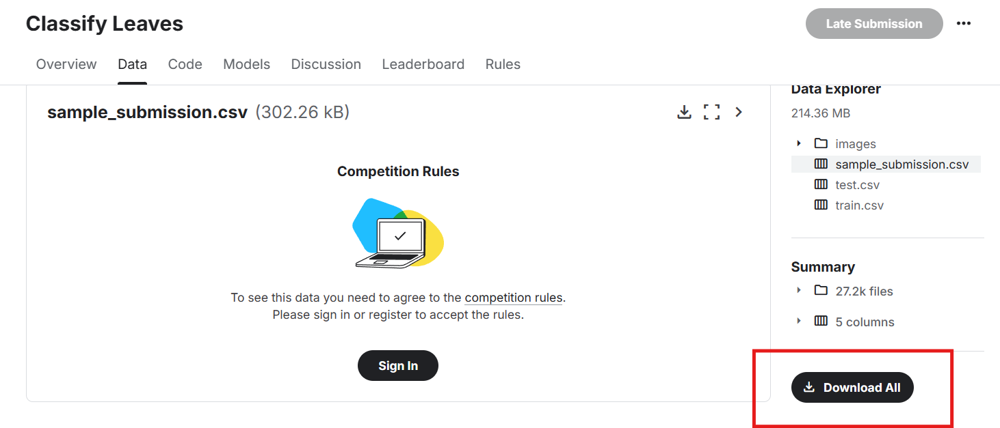

# classify_leaves

#### 介绍

本项目是参加了李沐大神《动手做深度学习（pytorch版）》B站课程竞赛的代码，因为是新手第一次写分类项目，所以做的很粗糙，欢迎大家批评

#### 网络架构

网络采用预训练的34层ResNet网络，并在牧神提供的18000+条图片数据上再进行训练，其中前14000条作为训练集，后14000条作为验证集。最后加以验证，预测精度可以到达91%以上

#### 使用说明

1. 安装必要的库

   ```
   pip install torch  #gpu和cpu版本示自己情况而定
   pip install torchvision
   pip install d2l
   pip install Pillow
   pip install pandas
   pip install numpy
   ```
2. 下载数据集

   进入竞赛网站[Classify Leaves | Kaggle](https://www.kaggle.com/c/classify-leaves/data)，选择DownloadAll下载完整数据

   
3. 修改代码中涉及到文件地址的部分，运行train.ipynb即可开始训练。训练结束后会保存模型，此时运行submission.ipynb文件利用训练好的模型测试结果。
